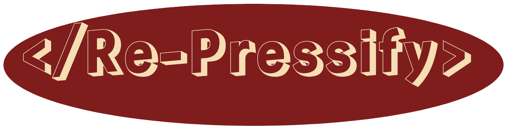

This is a [react](https://reactjs.org/) project bootstrapped with [`Vite`](https://vitejs.dev/).
It's modern, yet old school minded & privacy friendly newsreader & podcast player.



## Why another RSS reader ?

There are for sure, quite a handful of good news readers. Most of these are provided as SaaS which is usually bad for privacy. The purpose of this project is to be used mainly as a self-hosted app.
Also many of these apps usually contain more images than necessary, at least for my own taste.

> "We used to have readers, now we have lookers." <br> Samuel Katelbach, a nice guy.

## Features & Stack

- All server-side related data are being fetched using the amazing [`React Query`](https://react-query.tanstack.com/) library. It provides some really handy hooks for fetching, caching and updating data.
- Client-side state is handled by the Context API. Currently there is only one Reducer, but this may change as the app grows bigger.
- A [`MongoDB Atlas`](https://www.mongodb.com/cloud) instance is used as a DB.
- Authentication is handled via JSON token stored in a session cookie.

* Passwords are stored hashed using bcryptjs. Your feeds are also stored encrypted using the crypto module which comes with Express.
* No email required for registration. Therefore make sure to download the recovery key attached in the PDF file, once you signup for the first time. This file won't be shown again, unless you reset your password, and then you will be provided with a new key. This is also stored hashed.
* SendGrid is used for the contact form.
* All your pinned feeds are stored in localstorage.

## Limitations & TO-DOs

- Currently there's limited support for mobile devices. A react native version is to be developed at some point. It is therefore not suggested to be used with mobile devices at the moment.
- While you can rename the title of each feed, move it to a different category etc, you cannot rename the categories or add custom ones. This will be fixed soon.
- A dark theme is also to be developed.
- No tests exist at the moment.
- Google fonts are to be replaced using [`fonts`](https://github.com/coollabsio/fonts)
- SignIn/SignUp UX: Add a toggle to view/hide passwords. Perhaps debounce instead of onBlur to check realtime username availability.

## Getting Started

First, install the dependencies, both in the frontend & backend directories.

```bash
npm install
```

then, from the frontend folder run:

```bash
npm run build
```

Lastly, go to backend and run :

```
node app
```

## Configuration

Clone and start [`allOrigins`](https://github.com/gnuns/AllOrigins).<br>
You have to create a .env.local file in the root directory of both directories.
You need to set up some environment variables. Namely, for the frontend

```bash
VITE_BACKEND_API="your http://localhost:port or your domain"
VITE_ALL_ORIGINS="http://localhost:1458"
```

```bash
MONGODB_URI="YOUR-MONGO-DB-CONNECTION-STRING"
MONGODB_DB_COLLECTION="NAME-OF-THE-COLLECTION-IN-DB"
SENDGRID_API_KEY="YOUR-SEND-GRID-API-KEY"
FRONTEND_URL="your http://localhost:port or your domain"
SECRET_KEY="A 32 char string, maybe run  crypto.randomBytes(20).toString('hex')"
JWT_SECRET="A JWT secret key"
NODE_ENV="production or development"
EMAIL_RECIPIENT="your-email-address"
EMAIL_SENDER="an email address you have registered with your hosting provider and connected with SendGrid"
```

Now, you should be good to go!
